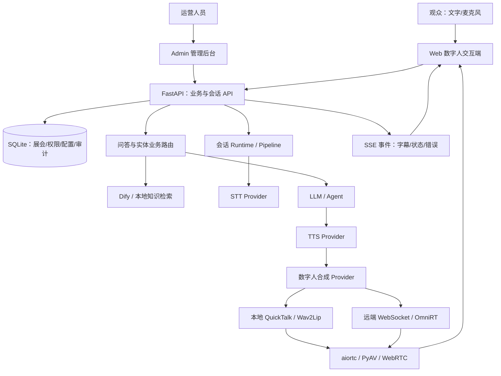

# Humantalk 展会数字人交互平台完整项目报告

**报告日期：2026 年 10 月 5 日（香港时间）**

**项目目录：`D:\Project\humantalk`**

**代码基线：`V2` 分支，HEAD `81f18e2`；另有本地未提交的 WebRTC 编码修复**

**报告用途：项目复盘、技术交接、成果汇报及后续迭代规划**

---

## 摘要

Humantalk 是基于 OpenTalking 实时数字人框架扩展的展会数字人交互平台。项目将数字人形象、口型驱动、语音识别、知识检索、大模型回答、语音合成、WebRTC 播放与展会运营数据结合，形成面向观众的互动终端和面向运营人员的管理后台。业务覆盖展会介绍、展商展品讲解、场馆点位与路线导航、活动排期查询、二维码登记、问答知识维护、数字人资产管理及运行配置。

项目的主要工程难点集中在三个方向。第一，多个异步环节共同决定实时体验，需要解决初始化竞态、媒体断供、音画时间戳、硬件编码协商和播放状态衔接。第二，展会业务具有强事实约束，需要协调结构化数据库、官方 QA、Dify 检索和大模型生成，避免关键词误匹配、无结果与服务故障混淆。第三，现场交互需要持续收音、唤醒、打断和弹窗展示协同工作，必须避免页面状态变化破坏麦克风生命周期。

项目已积累较完整的代码、专项测试和问题修复记录。能够确认的成果包括：展会运营闭环、数据批量导入、展会问答路由、多个 STT/LLM 服务配置、QuickTalk 多动作与高清缓存优化、真实休眠唤醒控制、中文展品拼音消歧，以及近期 H.264/NVENC 协商修复。部分历史验证仅覆盖专项测试或短时间服务器传输，尚不足以证明所有硬件、所有浏览器和长时间现场运行均达到稳定生产标准。

## 1. 报告依据、覆盖范围与事实边界

### 1.1 资料来源

本报告交叉核对了以下资料：

1. 当前仓库的 `AGENT.md`、README、依赖文件、配置样例、架构与业务说明。
2. API、管理后台、观众端、QuickTalk、STT、WebRTC、知识检索与存储相关源码。
3. 当前 HEAD 可达的 134 条 Git 提交记录，重点核对 2026 年 8 月至 10 月的演进。
4. 18 个当前可检索到的项目相关对话，其中包括归档对话；部分长对话额外读取了较早的记录。
5. 历史对话中的故障现象、调试结论、测试结果和部署说明。

这里的“完整”指覆盖当前可获得证据中的主要系统组成、业务链路和工程难题。聊天工具存在列表与分页范围限制，不能保证找到了项目创建以来的每一条对话，也未在本次报告编写中重新登录服务器或重复所有历史实验。

### 1.2 证据如何使用

报告使用四种表述区分证据强度：

| 表述 | 含义 |
|---|---|
| 当前代码确认 | 可以在当前文件或 Git 提交中找到相应实现 |
| 历史验证记录 | 过去的对话记录报告了测试、接口联调或服务器实验结果 |
| 曾实施后撤回 | 历史上实现过，但当前版本已经删除或调整 |
| 待验证/建议 | 缺少当前现场证据，或属于下一阶段工作 |

历史测试的通过数量不能相加成“项目总测试数”。不同记录可能包含同一批测试，不同时间的代码与环境也不同。本次任务是资料核对与报告编写，没有执行一轮新的全系统验收。

### 1.3 原框架与业务扩展的关系

OpenTalking 提供实时数字人编排、provider 接口、会话、媒体流水线及资产管理等基础。Humantalk 在其上增加或强化展会运营后台、结构化业务查询、展会知识问答、登记流程和现场交互。项目成果应表述为“集成并工程化实现”，不能据此声称独立训练了 QuickTalk、Wav2Lip 或 FlashTalk 基础模型，也不能将外部 OmniRT 的推理性能直接归为本项目原创算法性能。

仓库中保留了较早的设计提案。早期提案曾主张所有数字人推理统一交给 OmniRT；当前代码同时存在本地模型 adapter 和远端 backend。因此，当前架构以源码和 `AGENT.md` 为准，旧提案用于解释演进，不能作为已经完成的验收清单。

## 2. 项目背景、目标与应用场景

### 2.1 背景

展会现场的信息分布在展商资料、展品数据库、场馆地图、活动安排和知识文档中。传统查询页面需要观众主动定位菜单；普通聊天机器人即使能回答，也无法自然联动展品展示、导航与登记；只有数字人形象的演示系统又容易停留在预设视频播放，难以支撑真实业务。

本项目的目标是让数字人作为展会信息与运营服务入口，既能自然对话，也能准确调用后台维护的事实、图片、路线和登记信息。

### 2.2 核心目标

- **可交互：**支持文字与语音输入、字幕、播报、打断和唤醒。
- **有业务依据：**优先使用展会数据库、已发布官方 QA 和绑定知识库。
- **可运营：**管理人员能够维护展会、素材、话术、知识和服务配置。
- **可替换：**STT、LLM、TTS 和数字人驱动可以通过 provider/backend 切换。
- **可部署与诊断：**支持本地或远端运行，暴露健康状态、错误原因与媒体指标。
- **适合现场展示：**竖屏数字人、面部避让、弹窗、二维码与连续语音形成一致体验。

### 2.3 典型场景

| 场景 | 观众表达 | 系统预期处理 |
|---|---|---|
| 展会介绍 | “介绍一下这个展览” | 读取当前展会信息或官方话术 |
| 展品讲解 | “我想了解具身机器人” | 解析展品，显示资料并播报 |
| 导航 | “我想去机器人展区” | 识别目的地，返回路线和点位 |
| 活动查询 | “今天有哪些论坛” | 使用活动排期或知识资料回答 |
| 深层问答 | “这项技术的优势是什么” | 官方 QA 或 RAG/LLM 生成 |
| 导购登记 | “我想进一步了解这个产品” | 进入确认和二维码登记流程 |
| 迎宾 | “小美小美” | 从休眠唤醒，播报对应迎宾话术 |
| 运营维护 | 导入本届展商、展品与知识 | 预览校验、提交和审计 |

## 3. 系统架构与职责划分

### 3.1 总体架构



图中展示主要依赖关系，实际查询并非每次都依次经过所有组件。例如，固定官方答案可以直接进入 TTS；已有音频可绕过 STT、LLM 和 TTS；纯视频驱动可能使用浏览器素材播放。

### 3.2 关键目录

| 目录 | 职责 |
|---|---|
| `apps/web/` | 观众端、数字人舞台、语音输入、展品卡片、导航与登记 |
| `apps/admin/` | 展会运营、数字人管理、知识管理、系统配置和实时测试 |
| `apps/api/` | FastAPI 路由、管理 API、会话服务与展会 QA |
| `apps/unified/` | 便于开发和单机部署的统一进程入口 |
| `apps/cli/` | 诊断、下载、缓存准备、性能测试等工具 |
| `opentalking/core/` | Settings、backend 配置、registry、bus 与会话状态 |
| `opentalking/providers/` | STT、LLM、TTS、合成与 RTC 适配 |
| `opentalking/models/` | 本地数字人模型运行时与 adapter |
| `opentalking/pipeline/` | 会话和播报流水线、文本与音视频处理 |
| `opentalking/runtime/` | Worker、任务消费和运行时服务 |
| `opentalking/agent/` | 知识、Dify、记忆等桥接与存储 |
| `opentalking/avatar/`、`voice/` | 数字人形象和音色资产 |
| `configs/`、`scripts/`、`deploy/` | 配置、启动停止脚本及部署资源 |
| `tests/`、`apps/api/tests/` | 核心、API 与前端源码约束等测试 |

当前是 flat layout：Python 库在根目录 `opentalking/`，不是旧文档中的 `src/opentalking/`。

### 3.3 backend 分类

| backend | 实际含义 | 主要用途 |
|---|---|---|
| `mock` | 内置占位合成 | 首次跑通、开发联调、无权重测试 |
| `local` | 进程内模型 adapter | 本地 QuickTalk/Wav2Lip |
| `direct_ws` | 连接单模型 WebSocket 服务 | 独立模型服务 |
| `omnirt` | 调用外部 OmniRT audio2video 路由 | 远端重模型与推理服务 |

OmniRT 为可选外部服务。模型配置为 `omnirt` 时才依赖相应端点。本项目负责服务调用与业务编排，OmniRT 内部 CUDA/NPU、多卡 worker 与调度机制需要独立运维。

### 3.4 当前业务扩展改变了原始边界

基础框架的职责说明将账号认证列为外部生产能力；Humantalk 当前代码已经实现管理员认证、RBAC、JWT、令牌撤销和审计。这属于项目业务扩展，不能只根据基础框架说明得出“本系统没有认证”的结论。另一方面，存在管理员认证并不意味着媒体接口、部署拓扑和所有外部服务都已经完成生产级安全与高可用建设。

## 4. 技术栈与关键技术点

| 层次 | 当前使用的技术 | 工程作用 |
|---|---|---|
| 观众端与管理端 | React 18、TypeScript、Vite、Tailwind/CSS | 页面、状态、类型检查、构建 |
| API | Python、FastAPI、Uvicorn、Pydantic 2 | 请求校验、异步 API、服务入口 |
| 业务存储 | SQLite、WAL、事务、JSON records、关系表 | 单实例运营数据与配置 |
| 任务与会话 | Redis 相关接口、内存替代、Runtime/Worker | 按部署模式组织会话与任务 |
| 流式事件 | SSE、session/turn/trace 标识 | 字幕、状态、错误与链路追踪 |
| 媒体 | aiortc、PyAV、FFmpeg、OpenCV、NumPy | 编解码、帧处理与 WebRTC |
| 硬件编码 | H.264、NVENC，失败时软件回退 | 减少高清编码对 CPU 的占用 |
| 数字人推理 | QuickTalk、Wav2Lip、本地或远端合成 | 音频驱动口型与动作融合 |
| 模型依赖 | PyTorch、ONNX Runtime 等可选 runtime | 按模型及硬件安装 |
| 语音 | Edge TTS、DashScope、SenseVoice、MiMo、讯飞等适配 | 识别/合成服务替换 |
| 大模型 | OpenAI-compatible provider、DeepSeek/网关配置 | 对话生成与服务切换 |
| 知识与记忆 | Dify、本地知识接口、LightRAG/mem0 相关能力 | 检索与可选长期记忆 |
| 中文实体纠错 | pypinyin、SequenceMatcher | 同音/近音展品候选召回 |
| 数据导入 | openpyxl、ZIP、SHA-256 | Excel 校验和图片去重 |
| 管理安全 | Argon2、JWT、权限码、审计 | 密码哈希、授权和注销 |
| 测试 | pytest、tsx/node test、TypeScript 检查 | 单元、接口、状态与构建验证 |

Python 元数据声明 `>=3.10`；具体模型 extra 对 Python、PyAV、torch、mediapipe 等有兼容约束，仓库开发路线常用 Python 3.11。版本约束反映的是本地代码现状，不代表所有新版本依赖已经测试兼容。

一个特别重要的接口事实是：名称中带 “streaming” 或实现了 PCM 队列接口，并不自动意味着首字实时返回。当前讯飞 `transcribe_pcm_queue` 会先收集队列直到结束，再调用内部识别函数；后者按 40ms 音频帧发送，然后接收结果。因此，当前属于兼容队列入口的分帧识别实现，不能写成已完成“边收音、边发送、边接收修正”的全双工实时 ASR。

## 5. 已形成的业务功能体系

### 5.1 观众交互端

观众端围绕数字人舞台组织，包含展会选择、自动加载数字人、文字与语音输入、字幕、播报状态、手动打断、待机/倾听/讲话视频切换、实体资料卡片、导航展示和登记二维码。布局多次调整以适应竖屏，降低对面部的遮挡，并使展示弹窗可以滚动、放大、关闭和自动消失。

字幕位置已调整为用户输入在右侧、数字人回复在左侧；流式字幕也遵守同一方向。技术错误在观众界面被转换为可理解的提示，模型名、WebRTC、STT 等实现信息尽量留在管理配置和内部日志中。

### 5.2 展会运营后台

管理端覆盖展会、展商、展品、场馆、点位、路线、活动排期、应急播报等资料，并与数字人、音色、知识库和话术绑定。管理人员能够设置当前展会、维护业务关联、批量导入本届数据、配置识别服务与大模型，并通过实时测试工作台检查数字人运行。

### 5.3 知识与问答运营

问答不止是“调用 LLM”。系统包含已发布官方 QA、展会知识库绑定、Dify 多数据集检索、知识文档查看、未命中问题池及知识审核发布流程。结构化资料和已发布答案优先用于准确业务响应，RAG 用于扩展问答；服务异常必须与业务无结果分开处理。

### 5.4 资产与创作相关能力

仓库还保留图片/视频数字人、音色、人格包、轻量 2D 形象、视频创作、视频克隆、记忆与微信资料导入等框架能力。这些模块具有源码与测试入口，但本次展会项目的主要实证集中在实时对话和运营闭环。不能仅依据 README 中的支持描述，认定所有辅助创作功能都在当前服务器完成了真实模型验收。

## 6. 核心业务与媒体链路

### 6.1 一次普通语音对话

```text
浏览器麦克风
  → 音频采集、VAD、录音/PCM
  → STT 文本
  → 休眠唤醒门控
  → 当前展会实体与意图路由
  → 结构化业务 / 官方 QA / 知识检索 / LLM
  → TTS 音频
  → 数字人模型生成视频
  → 按音画时间关系入队
  → WebRTC 编码传输
  → 浏览器播放、字幕与业务卡片
```

每一层都可能有缓冲、线程、异步任务或外部网络调用。对“卡顿”“回复错误”或“无法收音”的诊断，应沿一次具体 session/turn 追踪，不能只看某个组件是否启动成功。

### 6.2 官方 QA 与 RAG

统一入口为 `POST /exhibitions/{exhibition_id}/qa/query`。当前 `ExhibitionQaService.query()` 的实际顺序为安全检查、已发布官方 QA 匹配、歧义问题澄清、知识检索、无结果记录与受约束的 LLM 回答。API 返回 `turn_id`、`trace_id`、匹配类型、来源和分数等诊断信息。

主要匹配类型包括 `official_qa`、`rag`、`clarification`、`fallback`、`retrieval_error`、`blocked`。固定答案、澄清与检索错误使用 direct 播报；RAG 将可信检索片段交给当前会话 Agent/LLM 生成。当前 fallback 同样使用 agent 模式，要求先承认没有官方资料，再提供通用建议，禁止补写未经确认的展会事实。

业务规则后来增加了“展会结构化数据未命中继续进入 QA”等回退处理。资料不足时如何允许通用大模型回答，需要结合当前展会策略判断；通用知识不能代替未经确认的展会日期、地点和展商事实。

### 6.3 数据、事件、媒体三条通道

- 业务 API 提供事实、卡片、导航和登记资料。
- SSE 提供字幕、会话状态、播报开始/结束和错误事件。
- WebRTC 传输实时音视频。

这三条通道必须协调。例如，合成生成完毕时音频可能仍在播放队列中；如果立即发出 `speech.ended`，前端会过早回到待机、恢复收音或触发休眠。当前代码会依据剩余样本和有界等待判断播放排空，而不是只依据 producer 结束。

## 7. 主要难题复盘：实时媒体、画质与模型运行

### 7.1 难题一：新上传数字人首次启动返回 HTTP 500

**现象：**管理后台上传新数字人后启动实时测试，初始化时间长，最终出现 HTTP 500。

**根因：**首次模型加载和缓存生成明显慢于热态运行。前端在 Worker 尚未准备完成时就发起 WebRTC 协商，原等待路径约 60 秒后触发未处理超时。API “创建会话成功”与模型 “可供媒体协商”被错误当成同一状态。

**解决：**管理端等待 session 进入 `worker_ready` 后再协商；增加约三分钟初始化等待与明确失败处理；Worker 保存真实初始化错误；API 将相应初始化/WebRTC 超时转换为可诊断的 503。分离 API/Worker 模式也同步处理。

**验证记录：**历史专项后端 91 passed、4 skipped，Admin 31 tests passed，类型检查和构建通过；完整后端另有既存录制下载断言失败。对应提交 `1a2c069`。

**技术收获：**长耗时模型初始化必须作为显式状态管理，并区分暂未就绪、最终失败和素材非法。仅延长请求超时不能解决初始化竞态。

### 7.2 难题二：待机清晰，讲话时整体模糊

**现象：**相同数字人待机时高清，讲话时衣服、背景或整个人物明显变糊。

**分层排查：**待机可能直接播放原始 MP4；讲话可能显示模型输出的 WebRTC 流。两条链路的源素材、模板尺寸、模型回贴和编码压缩并不相同。

历史线上素材检查发现，待机为 `1440×2560`，近似码率 `4.64 Mbps`；三段讲话素材为 `606×1080`，近似码率 `0.82/1.69/1.66 Mbps`。讲话源像素量约为待机的 17.8%。放大和提高发送码率不能恢复源素材已经丢失的细节。

进一步检查发现某次线上展项实际绑定 `video`，并非 QuickTalk；页面直接播放讲话视频，部分 QuickTalk/NVENC 配置并未作用于该路径。这说明诊断必须确认当前展会的模型绑定，而不能只看后端全局默认模型。

**解决措施：**统一动作素材规格；QuickTalk 检查讲话动作实际分辨率，低于目标尺寸 80% 的片段跳过并回退高清主模板；轻微放大使用 Lanczos；非目标 FPS 模板的临时转码提高到 CRF 16；输出模板、实际尺寸和 FPS 写日志；健康接口暴露相应参数。

**验证记录：**相关历史专项 41 项通过；当时 Face SR 独立测试缺少 `kornia`，不属于已通过项目。

**当前边界：**低清片段跳过会牺牲该动作的展示，但保留高清模板与口型。要同时保留动作和清晰度，需要重新提供匹配分辨率的源素材。

### 7.3 难题三：调高输出尺寸后仍然使用低清缓存

**根因：**旧 manifest 中 `template_900.mp4` 等路径优先级过高。即使设置较大 `MAX_LONG_EDGE`，运行时仍可能选择旧缓存；预处理也可能从旧模板放大，而不是从原始素材重新生成。

**解决：**优先选择与目标宽高相匹配的模板和 `face_cache_v3_<width>x<height>.npz`；缓存重建优先读取原始动作视频；缓存键包含相关路径与运行参数；记录实际命中模板；重建磁盘缓存后重启 API/Worker，清除内存 Worker。

**验证记录：**历史缓存路线相关 31 项测试通过，后续质量专项继续验证。

**技术收获：**缓存是模型输入的一部分。修改配置并不一定触发正确缓存失效，磁盘缓存和进程内模型状态必须同时考虑。

### 7.4 难题四：只有面部、嘴部模糊

**根因：**QuickTalk 当前典型生成面部块为 `256×256`，再放大、仿射变换和蒙版融合到原始全帧。面部在源视频中越大，局部细节损失越明显。Wav2Lip 则需要根据具体模型结构和权重判断输入尺寸，不能将历史普通模型的 96×96 与其他较高分辨率权重混写为统一规格。

**可用手段：**提高源素材质量、减少不必要缩放、优化融合区域，并在有预算时评估面部增强。全帧编码与面部生成分辨率是两个不同问题，单纯提高 WebRTC 码率无法恢复模型未生成的纹理；也不能直接将固定导出模型的输入参数从 256 改为 512。

缩小生成回贴区域、尽量保留眼睛额头等原始纹理曾被提出为优化方向，本报告不将所有相关建议写成已经完成的当前功能。

### 7.5 难题五：超分提升清晰度，却引入性能与同步问题

**曾实施方案：**QuickTalk 面部接入 Real-ESRGAN/TorchScript 超分，历史验证过 256×256 输入、512×512 输出、CUDA FP16。随后处理 basicsr 加载、`torch.jit.freeze()` 兼容等工程问题。

**性能矛盾：**历史测量超分约 14.4ms/帧。20 FPS 单帧预算是 50ms，超分单独就占约 28.8%，叠加 QuickTalk、融合和编码后容易超过实时预算。

**优化尝试：**隔两帧或三帧执行超分；保留当前帧口型，只复用高频纹理残差；将部分计算放到另一 GPU；缩小超分输入；降低输出 FPS 并增加预缓冲。14.4ms 隔两帧的约 7.2ms 平均摊销是计算估算，不能当成全链路实测提速。

**最终取舍：**提交 `4123859` 及历史对话确认，QuickTalk 超分运行时、配置、导出脚本和专用测试后来被删除；Wav2Lip 独立 GFPGAN 路线保留。删除后的历史 QuickTalk 专项 36 项通过。

**技术收获：**实时系统优先保证持续吞吐和同步。缓冲只能吸收瞬时抖动，不能修复长期生成速度低于播放速度；视觉增强必须纳入完整预算。旧聊天中的 `OPENTALKING_QUICKTALK_FACE_SR_*` 不应继续作为当前部署参数使用。

### 7.6 难题六：动作循环跳闪、切换出现黑帧或停顿

**根因：**动作末帧直接回到首帧产生不连续；首末帧重复会造成短暂停顿；前端原视频与实时流切换时也可能出现显示间隙。

**解决：**单片段使用无重复转折帧的往返索引。例如四帧的序列为 `0,1,2,3,2,1,0,1…`；动作边界使用有限帧数的 crossfade；维护待机/倾听/讲话状态与媒体覆盖层切换；多个提交持续修正自动加载与切换闪屏。

**对应记录：**`67e063d`、`0a5465f`、`3cfe2d6`、`e6003bb` 等。

**边界：**往返循环可以消除首尾跳变，但长动作倒放可能不自然。动作录制质量和片段间姿态一致性仍影响效果。

### 7.7 难题七：同一回复只重复一段动作

**历史行为：**一次完整发言选一段讲话动作，即使拆成多句音频仍使用同一段；下次发言才换另一段。

**当前实现：**本地 QuickTalk 多片段按顺序播放，片段播完切下一段，最后循环回第一段；只有一个片段时使用往返循环。`motion_cycle.py` 保存组索引和帧游标，运行时处理边界过渡。

**验证记录：**相关 9 项测试通过，提交记录包含 `f2bf0f8` 多动作测试。

**边界：**修改的是本仓本地 QuickTalk 调度。OmniRT 后端的动作管理需要在远端对应实现，不能认为本地修复自动改变了远端服务。

### 7.8 难题八：30 秒动作预热失败，要求支持 120 秒素材

**问题：**原动作读取上限较短；长视频直接用于完整预热会增加人脸上下文、缓存和显存开销。“预热失败”被当作“数字人无法启动”，导致观众端加载失败。

**解决：**默认读取上限扩展至 120 秒，非法或超上限配置受限；管理端标注单段最多 120 秒；预热只使用短模板；预热失败保留已加载资源并允许冷启动；真实异常写入后端日志。

过程中还发现 `face_sr_signature` 被误传给不支持该参数的 `RealtimeV3Worker`，修正为仅参与缓存键，随后整个 QuickTalk 超分功能又被撤回。

**验证记录：**视频时长相关 77 项 QuickTalk/API 测试通过；预热降级相关 48 项通过；Web/Admin 类型检查和构建通过。对应提交 `29f7e2d`、`ebef341`、`a04e23f`。

**边界：**“可读取至 120 秒”不等于所有机器都可同时承载多段 120 秒高清素材。应按分辨率、片段数、缓存和显存实测，必要时降低至 30/60 秒。

### 7.9 难题九：音画逐渐失步、媒体队列断供

**不同类型：**从头到尾固定偏差通常涉及时间戳或固定 offset；偏差持续扩大通常表示生成吞吐不足；两者同时停止则可能涉及编码、共享时钟或传输。

**项目措施：**修正媒体时间戳与队列衔接；按帧交错对应音频和视频入队；增加短时预缓冲与音频保留；限制最大视频队列和追赶范围；播放排空按实际样本时长计算；记录 render chunk、队列帧数、音频缓冲和 underrun。

**对应记录：**`e6fafc5`、`5f1d9ff`、`f64826c`、`e394965`、`6d48833`。

**取舍：**增加预生成块可减少播放中断，但增加首次开口等待。固定 offset 不能修复持续性能不足。队列需要有界，否则“不卡”可能只是延迟越来越大。

### 7.10 难题十：音频与数字人同时卡顿，GPU 编码配置未生效

**历史实测：**近期服务器排查发现请求 H.264/NVENC 的会话实际协商为 VP8 软件编码。讲话期间视频队列还有约 30～58 帧、音频缓冲约 2 秒，模型生成一段 480ms 音视频约需 220～380ms；同次记录中丢包约 0%、RTT 约 6ms，却反复出现 120～126ms 发送延迟。

这些数据支持优先排查编码与发送，而非直接归因模型供给或网络。对该次实验，生成耗时/媒体时长约 0.46～0.79，平均生成速度有实时余量，但不能据此保证其他输入和所有负载下都足够。

**确认根因：**`setCodecPreferences` 原来在 `setRemoteDescription` 后调用，aiortc 应用 offer 时已经完成共同 codec 选择，后设置偏好没有改变 VP8 优先顺序。

**修复：**提前设置 H.264 偏好，再接收 offer；记录实际协商 codec；当请求 NVENC 却得到其他 codec 时告警。NVENC 码率变化时调整已有编码器的 `bit_rate`，避免因频繁重建上下文造成停顿。

**声音为何也停：**音视频共用播放时钟。视频发送明显落后会影响共享时钟调整，音频随后也等待。因此“两个同时卡”并不能证明是两个独立组件故障。

**历史验证：**相关 19 项测试通过；同一 `1080×1440` 头像服务器侧 24 秒传输实验没有出现超过 120ms 的接收停顿，音频最大间隔约 35ms、视频约 68ms。历史对话报告已部署，并要求刷新浏览器重新建立会话进行实际播放确认。

**当前状态：**本次核对时对应 RTC、测试和高清配置仍为本地未提交变更。该短测试不构成长期真实浏览器或展会现场验收，也不能据此宣布所有卡顿永久消失。

## 8. 主要难题复盘：展会问答、知识与实体识别

### 8.1 难题十一：关键词命中但回答无关，导航与介绍冲突

**现象：**用户说“我想去机器人展区”，系统可能因机器人关键词进入展品介绍；相似问题也可能询问不同事实。

**解决：**将“想去、要去”等目的地请求优先路由导航；区分展会、展商、展品、点位和路线；避免将展会编码匹配成展商；官方 QA 除字符串相似度外加入意图兼容检查，区分时间、地点、主办方、报名、交通等类别。

**验证记录：**导航历史联调正确命中相应路线，Web 42 项测试、类型检查与构建通过。提交 `1cfea97`；其他相关记录包括 `2d3ebfa`、`3448667`。

**技术收获：**文本相似不等于意图相同。业务路由应先确定用户要执行的操作，再确定对象，避免一个模糊关键词承担全部决策。

### 8.2 难题十二：Dify 有数据，本系统却检索不到

**问题组成：**展会和知识库的 Dify dataset 映射不一致；默认 registry 未加载；多个知识库绑定未被统一使用；文档列表与实际检索来源不一致；应用传入的检索参数与 Dify 控制台保存策略不同。

**解决：**统一配置发现与映射；支持多个数据集和共享知识库；同步 registry；修正文档列表和详情查看；对多个目标并发检索并整理来源；当前代码注释明确说明避免显式 `retrieval_model` 覆盖导致线上结果偏离控制台，使用保存的检索设置。

**对应记录：**`dc7983b`、`3c799ef`、`2e021cb`、`e0cef47`、`4cdab03`、`4828690`、`1e525a5`、`8ac3c4b`。

**关键区分：**401、超时、5xx 等属于 `retrieval_error`，不能计入业务未命中池。否则运营人员会将服务故障误当成知识缺口，重复补录已经存在的答案。

### 8.3 难题十三：结构化数据库没命中就停止回答

**问题：**展品、路线等确定性查询没有结果时，如果业务分支直接结束，就绕过了现有 QA/知识检索，导致本可回答的问题进入空白或错误兜底。

**解决：**未命中时进入统一 QA 回退；确定性业务结果存在时继续直接使用，避免无必要地让 LLM 重述事实；模糊问题先澄清；明确无结果时再记录未命中。提交 `9d1474b` 对应这一修正。

**技术收获：**业务路由不应形成多个互相截断的独立聊天系统，所有入口应共享合理的回退与追踪机制。

### 8.4 难题十四：ASR 把“具身机器人”识别成“巨声机器人”

**问题：**文字数据库匹配无法处理典型同音、近音错误；既有汉字编辑距离和精确关键词门槛不足以稳定触发展品展示。

**实际实现：**语音输入在普通实体匹配不足时调用当前展会的实体 resolve 接口。服务端只处理当前展会展品名称及其启用的模糊关键词，提取中文字符串，使用 `pypinyin.lazy_pinyin` 转拼音，对等长度滑动窗口计算 SequenceMatcher 相似度。

当前代码的候选阈值为 0.92，最多返回前三项；第一与第二候选差小于 0.04 时返回 `ambiguous`；否则返回一个匹配。前端追问或使用已确认展品标准名称继续讲解与登记。

**验证记录：**覆盖该误识别、近音歧义、无关问题及关闭模糊识别；实体匹配测试与类型检查通过。对应提交 `81f18e2`。

**明确边界：**尚无现场音频端到端准确率结论；当前没有证据证明建立了持久化拼音索引，代码实际按候选动态计算。短于四个中文字的词、英文型号、中英混说、同音且相似的多个名称仍需专门处理。

**技术收获：**保留原始 ASR 文本，以业务对象 ID/标准名称驱动后续流程；近音只负责候选召回，歧义需要确认。全局替换“巨声→具身”会误改无关表达，不适合作为通用方案。

## 9. 主要难题复盘：语音交互与前端状态

### 9.1 难题十五：展品弹窗出现后暂时不能语音输入

**根因与表现：**展示字幕或卡片时，输入组件的条件渲染与监听状态发生冲突。组件隐藏/卸载或错误状态恢复破坏持续收音，观众必须等界面切换才能再次说话。

**解决：**展示状态下保留语音输入组件挂载；修正字幕激活时的容器显示；关闭资料卡片、导航或登记时恢复对话；新一轮输入清理上一轮残留展示；语音监听与弹窗的视觉显示分开控制。

**证据：**提交 `d018e29`、`68e62d5`；当前 `test_presentation_close.py` 检查输入保持挂载、展示关闭和旧资料清理。

**边界：**部分测试是源码断言，只能防止特定代码结构回退，不能替代浏览器真实麦克风和 MediaStream 生命周期测试。

### 9.2 难题十六：数字人把自己的播报当成用户发言

**解决演进：**增加默认“回答期间暂停监听”：用户提交后到思考、播报期间暂停 VAD/STT，不保留预录音，不触发自动抢话；收到播放结束、错误或手动打断后恢复。

后来增加可选“麦克风模式”：默认关闭，开启后播报期间仍允许收音，并沿用 VAD 打断；关闭后恢复暂停策略。Vidu 的麦克风状态也纳入同一开关。

**取舍：**暂停模式减少回声自触发，但不能语音抢话；持续收音模式便于自然打断，却要求真实现场回声、扬声器距离和浏览器音频处理效果验证。

**验证记录：**暂停门控有历史两项专项回归和前端构建；麦克风模式类型检查通过，但对应记录明确尚未用真实麦克风验证打断效果。

### 9.3 难题十七：唤醒词配置存在，但休眠时仍然回答

**原问题：**系统识别了唤醒词并有倒计时，却在未唤醒且没有命中唤醒词时仍调用普通对话。配置成功不等于门控真正生效。

**解决：**建立休眠/唤醒状态机。启用唤醒词时初始休眠；未命中的语音丢弃，不进入 QA/LLM；单独唤醒词触发迎宾；“唤醒词+问题”去词后处理问题；唤醒期间无需重复口令；有效对话刷新超时；播报期间不休眠，结束后重新计时。

沿用后台 `wakeActiveSeconds` 作为唯一超时来源，避免多字段冲突；增加休眠提醒。唤醒词编辑保留原始文本，在保存时才按中英文逗号、顿号和换行拆分、去空项和去重。

**验证记录：**历史 Web 61、Admin 37 项及 API 专项通过，后续配置/提醒相关批次继续验证。提交 `d21d354`、`423f566`、`dcf397b`。

**边界：**当前主要是在 STT 文本之后匹配唤醒词，并非独立低功耗声学唤醒模型。休眠可能仍然消耗识别服务；唤醒词本身的 ASR 误识别需要另行评估，展品拼音纠错不能自动等同于唤醒词纠错。

### 9.4 难题十八：确认流程锁住用户，无法切换话题

**问题：**展商后续询问、内容澄清、登记确认等 pending 状态会把新问题误当作上一轮确认回答。

**解决：**对输入区分确认、取消和新话题；新话题清空待确认状态再进入正常路由；新一轮资料展示替换旧内容；避免关闭登记又重新弹出旧展品卡片。

**对应记录：**`ab542f5`、`f34bd14` 和 pending conversation/exhibitor followup 专项测试。

**技术收获：**多轮状态必须可退出。业务流程的便利性不能建立在阻止用户提出新问题的基础上。

### 9.5 难题十九：麦克风已允许，界面仍提示 HTTPS/权限问题

**现象：**近期 Edge 页面显示“请用 HTTPS 并允许权限”，但截图显示 HTTPS 正常、网站已允许麦克风。

**已确认问题：**前端对多种音频初始化失败使用同一固定文案。因此提示不能区分权限拒绝、无设备、设备占用、AudioContext 或初始化生命周期错误。

**当前状态：**历史对话最后一次诊断/修复过程被中断，没有可靠完成结果；本次不将其写成已经修复。仍需准确保留错误名、释放失败后申请的流，并分别展示权限、设备和音频初始化原因。

### 9.6 难题二十：双媒体元素可能重复播放音频

历史静态排查曾发现同一远端流同时交给可发声 video 和隐藏 audio 的路径。这可能导致重音、回声或听感异常，但没有证据证明其就是近期音画同步停顿的主因，也未据此确认完成独立修复。后续应明确每种播放模式唯一的可听音频出口，再通过浏览器实测确认。

## 10. 服务接入与配置切换中的难题

### 10.1 讯飞 STT 与 TTS 需求澄清

用户曾提出接入讯飞 STT/TTS。历史早期方案建议分别增加签名、音频格式转换、配置表单与 provider。当前可以确认的是讯飞 **STT** adapter、factory、管理端独立凭据配置和展会选择入口；本次扫描未发现对应讯飞 TTS adapter，不能将“曾提出 TTS 方案”写成“讯飞 TTS 已上线”。现有方案仍可使用 Edge 等 TTS。

讯飞 STT 使用 AppID/API Key/API Secret，服务端通过 HMAC-SHA256 构造带时间签名的 WebSocket URL；音频要求 16kHz、单声道、16-bit，内部按 1280 字节分帧。当前实现有长度限制和错误返回，但真正边采集边修正的端到端流式行为仍需增强。

### 10.2 MiMo 请求格式不等于其他 OpenAI-compatible 音频接口

接入 MiMo 时修正了音频 WAV Data URL 请求格式，并设置中文识别参数。历史相关 11 项测试通过，真实静音请求成功，说明连接、鉴权和请求格式可用。静音样本不能用于证明准确率、方言效果或现场噪声鲁棒性。

技术收获是：协议标称兼容并不保证每个厂商对音频字段、模型和参数的解释一致，应按 provider 处理差异。

### 10.3 两家 STT 配置互相覆盖与默认配置误解

**解决：**管理后台增加独立 STT 配置页。讯飞与 MiMo 的配置分别保存，保存不等于切换默认；点击“设为默认 STT”才改变默认服务；密钥不回显，留空可以保留。

全局默认与展会运行配置又是不同层级。某场展会如果显式选择 MiMo，即使全局默认是讯飞，该场仍用 MiMo。随后把讯飞选项补入展会与实时测试下拉框。

**验证记录：**配置专项历史 24 项通过，管理端构建通过；该批记录明确没有用真实语音验证两家在线服务。对应 `d62c7a4`、`2ec2037`。

### 10.4 切换 DeepSeek 后原第三方网关配置丢失

**问题：**将当前 LLM 替换为 DeepSeek 时，原网关和密钥需要保留，否则切回需要重新配置。

**解决：**保存多套大模型配置；首次切换前自动保留原运行网关；管理端能选择当前配置并测试连接；凭据在服务端使用。对应 `9146011` 与后续 `f323cf6`。

**验证记录：**相关测试与构建通过；当时完整管理 API 21 通过、1 个 Windows 磁盘监控失败。不能将这个结果改写为全套 API 全部通过。

### 10.5 配置优先级导致“改了却没生效”

项目存在环境变量、`.env`、legacy 变量、YAML、代码默认、管理员保存配置、展会配置和请求覆盖。不同配置维度的规则需要分别追踪，不能用一条优先级表解释所有情况。

模型 backend 解析按内置默认、YAML、模型级环境变量覆盖；启动脚本会导出模型级 backend。服务 provider 还可能有管理与请求级选择。Shell 中 `source .env` 不会改变已运行进程，systemd/容器也不会自动继承另一个终端的环境。

诊断应依次确认：当前展会绑定、当前会话请求、后端已加载 Settings、实际运行的 provider/backend、日志记录的模板与 codec。

## 11. 后台表单、数据管理与安全

### 11.1 业务表单错误不可见

场馆、展商、展品、点位、路线等表单曾出现保存失败但错误显示在遮罩下方。解决方法是将字段和业务错误放在当前弹窗内，长表单自动滚动到错误位置，重新打开时清理旧错误。

另有通用弹窗组件导致输入失焦的问题，通过保持组件身份与渲染稳定性修复。提交 `0a45ff5`、`86db44b` 等体现这一轮后台体验修正。

### 11.2 点位、欢迎配置和话术保存失败

新增点位缺少所属展会时，根据已选场馆自动补全；欢迎话术下拉只显示当前展会且启用的迎宾话术；保存前检查绑定有效性；话术表单展示的展会与提交 `exhibitionId` 保持一致，旧 ID 失效时选择有效展会。

错误解析改为同时保留明确业务原因与脱敏展示，避免全部变成“操作未完成”。相关记录包括 `47262d3`、`5657f03`、`4452b07`。

### 11.3 认证、权限与令牌生命周期

管理员密码通过 Argon2 哈希保存；JWT 区分 access/refresh 类型，使用 `jti` 对接已发放/撤销记录；接口按权限码授权；审计记录操作。登录和服务错误避免直接向观众暴露内部信息。

前端增加滑动续期：有效后台 API 操作时检查，最多约每分钟续期一次，并发请求复用同一续期 Promise；成功后同时更新令牌和本地会话。主动退出与过期统一清理存储及用户状态。对应 `64cf051`、`d09523f`。

当前代码允许未配置固定 JWT secret 时使用进程内随机 secret。这适合简单单进程启动，但重启或多实例会影响签名一致性；生产需要固定管理密钥并评估多实例行为。报告不包含真实凭据。

## 12. 展会数据一键导入的设计与难点

### 12.1 两阶段流程

```text
下载模板 → 上传 XLSX/ZIP → 预览校验与关系解析 → 确认提交 → 记录批次与审计
```

工作表覆盖展商、展品、场馆、点位、路线、路线点位、活动排期、应急播报、知识库、知识文档和官方问答。模板通过颜色、必填标签和批注降低操作人员理解成本。

### 12.2 关键工程处理

- 新增 ID 可留空，更新记录使用已有 ID；相同 `kind + id` 更新，不删除模板中未出现的记录。
- 当前展会 ID 自动补入；文件显式引用其他展会时阻止提交。
- 关系字段支持 ID、名称、编码或展位号，预览时解析，避免提交后才发现断链。
- 路线至少两个点位；缺少基础指引时依据点位生成。
- 图片使用 keep/replace/clear 三种显式策略，避免空字段意外清除资料。
- 图片按 SHA-256 去重；数据库提交失败时回滚记录并清理本批新增资源。
- 批次记录操作者、文件、校验与提交状态；`event:import` 控制权限。
- 已发布知识文档可作为无 Dify 情况下的本地确定性检索素材。

### 12.3 技术意义

导入的难点是跨表关联、展会隔离、文件与数据库的一致性，而不仅是读取 Excel。两阶段提交使运营人员能够先审阅错误，再写入正式数据。当前存储有事务入口与导入 API 测试，但高并发批量导入和非常大型数据集仍需要独立压力验证。

## 13. 部署与运维难题

### 13.1 页面能打开，WebRTC 舞台仍空白

超算/SSH 部署中曾出现网页与 offer 返回成功、数字人素材和首帧正常，媒体 `packets_sent=0`，最终 ICE failed。根因是 SSH 隧道只转发网页/API TCP，WebRTC 媒体 UDP 路径没有建立。STUN 提供候选发现，不等于拥有可达中继。

解决方向包括让浏览器与计算节点处于同一可达内网，或部署两端都可访问的 TURN；历史脚本还加入 TURN/TCP-over-SSH 方案。本报告将其列为配置与部署尝试，最新读取记录仍有作业等待资源，不能认为新方案已完成最终视频验收。

### 13.2 申请了八张 GPU，实际只用了两张

历史 FlashTalk 部署记录显示资源申请与启动进程数不一致。后续任务配置改为八卡/八进程，但任务因队列优先级等待。调度器分配 GPU、进程可见 GPU 和模型实际并行三者需要分别验证，不能仅依据资源申请数声称模型已八卡加速。

### 13.3 停止脚本说未启动，端口仍被占用

`not_started` 只代表未找到对应 PID 文件。直接通过 Uvicorn 启动、旧入口或服务管理器运行的 API 仍可能存在。

改进停止脚本时补充 unified API 识别，并校验进程所属仓库与目标端口，避免误停其他 Python 服务；Bash 语法和专项测试有通过记录。systemd、Supervisor、容器自动重启的服务仍应由对应管理器停止。

### 13.4 日志查错部署对象

近期排查曾用 Docker Compose 查询 api/worker，但实际容器是 Dify，数字人由 Python 脚本启动，前端为 Vite。容器无日志不能证明数字人没有运行。正确方法是核对端口、PID、命令行、cwd、前端代理环境和真实日志文件。

HTTP 与 HTTPS 混用也会造成“空响应”的误判。健康路由应确认是 `/healthz`、`/health` 还是代理映射后的路径，而不是凭旧部署习惯使用固定命令。

### 13.5 Git 分支偏离、未完成合并与 Vim 交换文件

服务器和开发端都直接产生提交后，V2 分支出现 divergence；未完成 merge 又会阻止新 pull；Vim 遗留 MERGE_MSG 交换文件进一步干扰合并提交。

处理时确认 branch/status、左右提交差异和 MERGE_HEAD，保留服务器修复，通过明确 merge 完成整合；处理交换文件前核对进程是否仍在编辑。不能通过强制重置或删除运行数据来掩盖 Git 状态问题。

### 13.6 测试数据库和运行资产进入版本控制

历史误提交包括 pytest 临时 SQLite 文件。提交 `b10849c` 清理了 28 个生成测试文件，并忽略测试输出、运行时 custom avatar 和机器特定 env。正常测试代码保留，运行资产未删除。

技术收获是区分源码、测试输入、测试产物、运行数据库、模型权重和用户资产。生产数据库与头像不应通过 Git 清理策略处理。

## 14. 项目演进时间线

以下是本仓可见历史中的主要阶段，不代表基础框架最初研发时间。

| 时间 | 阶段 | 代表工作与提交 |
|---|---|---|
| 2026-08-04～08-08 | 系统入口与后台接通 | 本仓初始提交、server API/Admin、启动代理、上传回显、展会绑定 |
| 2026-08-11～08-12 | 展会 QA 与语音闭环 | V1.5 问答、Dify、中英文回复与关键词交互 |
| 2026-08-17～08-23 | 运营和资料展示 | 弹窗、二维码、点位导航、导入、多知识库、审核闭环 |
| 2026-08-24～08-30 | 高清与媒体同步 | video 驱动、NVENC、码率、按帧交错、时间戳、媒体监控、多动作 |
| 2026-09-02～09-07 | 初始化与现场交互 | worker_ready、动作衔接、弹窗语音、欢迎话术、唤醒、Token 续期 |
| 2026-09-10～09-17 | 清晰度与兼容性优化 | 超分尝试、TorchScript/basicsr、Vidu 修复、高清模板、循环闪烁 |
| 2026-09-20～09-23 | 长动作与性能取舍 | 120 秒素材、预热降级、删除 QuickTalk 超分、MiMo ASR |
| 2026-09-27～09-29 | 配置与交互完善 | 麦克风模式、讯飞 STT、DeepSeek/网关保留、独立 STT 配置、多动作 |
| 2026-10-02 | 语音展品实体纠错 | 拼音候选与歧义确认，`81f18e2` |
| 本次报告前的近期工作 | 音画共同卡顿定位 | H.264 协商提前、NVENC 码率原地更新；本地尚未提交 |

## 15. 验证结果与其适用范围

### 15.1 已有验证体系

项目包含 provider/config/model 单元测试、API 测试、前端纯函数和状态测试、源码约束测试、TypeScript 类型检查、生产构建、Bash 语法检查与部分真实接口/服务器实验。

`tests/frontend/` 中一些 Python 测试是读取 TSX/CSS 进行断言，并非浏览器 E2E。它们可以保护重要结构，但不会真正申请麦克风、建立 WebRTC 或渲染帧。报告在说明测试通过时必须保留这一差别。

### 15.2 历史专项证据表

| 主题 | 历史结果 | 可支持的结论 | 不能支持的结论 |
|---|---|---|---|
| 初始化竞态 | 后端 91 passed/4 skipped；Admin 31 passed | 准备状态与异常路径得到专项覆盖 | 所有素材首次启动都无超时 |
| 长动作上限 | 77 项 QuickTalk/API 通过，前端构建通过 | 时长规则和相关接口已验证 | 任意显存可承载多段高清 120 秒素材 |
| 预热降级 | 48 项相关测试通过 | warmup 失败不必阻断会话 | 素材真正不可用也能正常生成 |
| 高清模板/动作 | 31/41 项不同批次通过 | 缓存与质量保护路径验证 | 已取得统一现场画质评分 |
| 多动作循环 | 9 项通过 | 本地片段索引与切换规则有效 | 远端 OmniRT 自动具有同样行为 |
| 删除 QuickTalk 超分 | 36 项通过 | 当前无该超分链路且相关路线可回归 | 不再存在任何面部模糊 |
| MiMo 接入 | 11 项通过，静音在线调用成功 | 请求格式与服务连通 | 真实识别准确率已验证 |
| 独立 STT 配置 | 24 项通过，Admin 构建成功 | 配置独立保存和切换 | 两家现场服务都稳定 |
| RTC 最近修复 | 19 项通过；服务器 24 秒实验 | 实验中协商与接收间隔改善 | 长期浏览器端零卡顿 |
| 拼音纠错 | 示例、歧义、无关、关闭规则覆盖 | 文本层展品消歧可用 | 所有方言/噪声 ASR 已解决 |

### 15.3 公开基线如何引用

仓库 benchmark 文档记录 Wav2Lip 3090 示例约 33 FPS，以及外部 OmniRT/FlashTalk 的特定 Ascend 八卡热态结果。这些是不同硬件、模型、输入和运行模式的历史基线，不能拼成项目统一性能指标，也不能将模型 FPS 写成端到端首响。

目前没有本次重新测量的全链路 P50/P95/P99 首响、小时级断流率、现场实体准确率和统一并发容量结果。

## 16. 工程亮点与可总结的成果

### 16.1 多能力组成可运营业务闭环

项目将数字人展示与展会数据库、知识问答、导航、登记和后台运营联系起来，完成“维护资料→观众询问→实体展示与播报→后续确认/登记”的流程。其价值主要在系统集成、状态协同和业务可运营性。

### 16.2 可替换的模型与服务适配

provider/backend 分层允许按环境选择 mock、本地或远端模型，语音与 LLM 可以独立替换。独立保存多套配置、避免切换覆盖原网关，提高了现场运维的可回退性。

### 16.3 有事实依据的混合问答

数据库确定性查询、已发布 QA、Dify 检索与 LLM 生成各自承担适当任务；意图兼容、澄清和异常分类避免“相似就回答”。未命中池与知识运营形成改进入口。

### 16.4 针对中文业务名称的实体消歧

拼音候选在限定展会范围内处理 ASR 近音错误，配合歧义确认，解决字符匹配无法覆盖的典型问题。这是明确的业务工程优化，但尚不构成经过对比实验验证的独立算法创新。

### 16.5 从症状到证据的媒体诊断

项目可以对齐 render、队列、音频缓冲、codec、丢包和 RTT，最终发现“NVENC 配置存在但协商未生效”的真实问题。相比单独增加 GPU 或码率，这类链路诊断更有解释力和可迁移性。

### 16.6 通过取舍保护实时体验

超分并非盲目保留，而是在兼容、计算预算和同步问题后撤回；长素材预热失败允许冷启动；低清动作保护高清输出。这些体现工程上的降级与能力边界管理。

## 17. 当前未完成事项与风险

| 事项 | 当前证据与影响 | 下一步 |
|---|---|---|
| 最新 RTC 修复尚未提交 | 本地三文件修改；历史报告已部署 | 单独审查提交，记录服务器 commit 与配置 |
| 浏览器真实长期卡顿验收 | 仅短时服务器传输证据 | 固定样本、多浏览器和小时级现场测试 |
| 麦克风错误诊断 | 近期修复流程中断 | 区分权限/设备/AudioContext，验证失败清理 |
| 双元素音频播放 | 静态发现，缺少独立闭环 | 明确单一音频出口并实测回声 |
| 讯飞 TTS | 有方案，未确认实现 | 若仍需要，单独开发 adapter 与在线联调 |
| 讯飞真全双工 ASR | 队列先聚合再发送 | 并发发送/接收、增量修正、取消和超时 |
| 方言能力 | 服务选择与按钮不等于效果 | 真实四川口音、噪声和专名对比实验 |
| 拼音消歧规模与覆盖 | 当前动态匹配，中文长词为主 | 多音字、短词、英文型号、候选索引 |
| 长动作资源预算 | 120 秒规则已实现 | 不同分辨率/片段数的显存与初始化测试 |
| 超算 TURN 方案 | 后续任务曾 Pending | 当前资源状态、TURN 可达性和媒体验收 |
| Vidu 与辅助创作 | 有实现/修复记录，缺统一真服务验收 | 按能力建立独立验收范围 |
| 单实例存储与配置 | SQLite/WAL，进程内状态 | 并发容量评估后再决定数据库和扩容 |
| 自动化测试覆盖不足 | 部分前端是源码断言 | 增加关键用户路径浏览器 E2E |
| 历史文档与配置漂移 | 多个语言/目录，旧路线仍存在 | 收敛事实来源，标注历史文档 |

历史记录中存在 Windows `psutil`/磁盘监控、缺可选依赖、录制下载断言等失败。这些需要按当时环境与最新代码重查，不能简单归因于本次功能，也不能在报告中抹去。

## 18. 后续工作与验收建议

### 18.1 第一优先级：闭合现场可靠性问题

先完成 RTC 修复版本归档、麦克风失败清理、单一音频播放出口和浏览器实测。固定一组头像、动作、文本、STT/TTS/provider 与网络条件，连续重复，记录会话和故障时间。验收记录必须包含版本、配置和硬件，避免无法复现实验。

### 18.2 第二优先级：建立量化指标

| 维度 | 应记录的指标 |
|---|---|
| 首响 | 语音结束到首字幕、首音频、首视频；P50/P95/P99 |
| 推理 | chunk 耗时、媒体时长、RTF、冷/热启动差别 |
| 音画 | 固定偏移、随时间漂移、最大停顿、断供次数 |
| 传输 | 实际 codec/encoder、码率、丢包、RTT、抖动 |
| 客户端 | framesDecoded、framesDropped、concealedSamples、jitterBufferDelay |
| 业务 | 官方 QA 命中、实体误匹配、澄清成功、无结果与故障比例 |
| 运营 | 导入失败原因、知识补录后的改善、配置回退成功率 |
| 资源 | CPU、GPU、显存、编码负载、长会话缓存增长 |

RTF 可按“生成耗时/对应媒体时长”计算。首响、稳态吞吐和网络播放应分开记录；缓冲参数优化时同时测首次等待与后续断流，不能只测其中一项。

### 18.3 第三优先级：语音与实体评测

构建真实现场语音集，包含普通话、四川口音、多人背景噪声、展会专名、近音展品、短名称、英文型号和中英混说。分别测 ASR 原文、纠错候选、最终业务命中和错误展示率。

比较“仅字符匹配”“别名”“拼音候选+消歧”三种路线，区分自动匹配正确率与追问成本。只有建立此类可复现对照，才适合把当前优化提升为量化技术成果。

### 18.4 第四优先级：稳定部署与运维

确定正式服务管理方式，统一端口、日志、环境文件和健康路由；代码更新与数据库/资产备份分开；服务器减少直接产生业务开发提交；保留可回滚版本。对 TURN、外部语音、Dify 与 LLM 建立连通诊断，避免页面可打开被误当成全链路可用。

### 18.5 第五优先级：降低代码与文档维护成本

按语音状态、展会业务、展示状态、媒体连接和配置解析逐步拆分较大的组件/路由文件；保留共享类型和纯函数测试。收敛重复中英文文档，标明当前推荐入口与历史方案。以具体故障和需求驱动重构，不进行没有验收收益的整仓改写。

## 19. 可用于成果汇报的项目总结

本项目围绕展会场景构建了数字人交互与运营平台，打通观众语音/文字输入、展会数据库与知识检索、LLM、TTS、数字人驱动和 WebRTC 播放，配套管理后台、素材管理、批量导入、问答发布与登记业务。

开发过程中重点解决了数字人首次初始化竞态、高清模板与缓存误用、动作循环和衔接、长素材预热、音画队列与时间戳、H.264/NVENC 协商、弹窗与持续收音冲突、真实休眠唤醒控制、服务配置切换，以及中文展品 ASR 近音消歧。项目使用专项自动化验证、类型检查、构建和部分在线联调建立了修复证据。

当前成果足以支撑项目交接和工程复盘。进一步形成生产稳定性或算法性能结论，需要补充长时间浏览器现场验收、统一性能基准、真实语音数据集与实体匹配对比实验。

## 20. 实现详解一：数据模型、数据库与业务关联

以下章节补充源码级实现，按“入口→数据→处理→输出→异常”说明。代码片段标注为简化流程的地方仅用于解释，并非可以直接替换源码的补丁。不同模型使用的 Runner 路径存在差异，不能将一个 Runner 的内部行为套用于全部模型。

### 20.1 SQLite 的连接与事务边界

`AdminStore.connect()` 是数据库访问的共同入口。每次建立连接时设置 `timeout=30`、`check_same_thread=False`、`sqlite3.Row`，开启 `PRAGMA foreign_keys=ON` 与 `PRAGMA journal_mode=WAL`。上下文正常结束后 commit，异常时 rollback，最后 close。

WAL 改善读写并行，但不把 SQLite 变成多写者数据库；`check_same_thread=False` 允许连接跨线程使用，也不代替应用的并发一致性设计。当前大量业务通过短连接和事务完成，适合单实例起步。

### 20.2 通用业务记录模型

`admin_records` 采用以下结构：

```sql
CREATE TABLE admin_records (
    kind TEXT NOT NULL,
    id TEXT NOT NULL,
    exhibition_id TEXT,
    data_json TEXT NOT NULL,
    created_at TEXT NOT NULL,
    updated_at TEXT NOT NULL,
    PRIMARY KEY(kind, id)
);
CREATE INDEX idx_admin_records_exhibition
    ON admin_records(kind, exhibition_id);
```

`kind` 区分 `exhibitions`、`exhibitors`、`exhibits`、`venues`、`points`、`qa`、`miss_pool` 等业务对象。业务字段保存在 JSON 中，公共索引字段保存在关系列中。优点是新增业务模块不必每次修改实体表；代价是 JSON 中的字段类型、业务外键、发布规则主要依赖 API 层检查。

`save_record()` 为无 ID 对象生成 `<kind>-<uuid前12位>`，补充时间字段，再执行 `INSERT ... ON CONFLICT(kind,id) DO UPDATE`。冲突更新时替换该记录的 JSON 和所属展会；因此调用方应传完整合并后的记录，不能把它理解为数据库自动执行字段级 PATCH。

`list_records()` 先使用 `kind/exhibition_id` 查询，再在 Python 中对状态和 JSON 文本关键词过滤。它没有为所有业务字段建立 SQL 索引，也不是全文检索引擎；较大数据量下需要评估加载范围和查询成本。

### 20.3 关联表与业务外键

`admin_record_links` 用 `(owner_kind, owner_id, link_kind, link_id)` 作为复合主键，记录诸如展会绑定知识库等关系。`set_links()` 在事务中先删除该关系类别，再批量插入新列表。

场馆→展会、点位→场馆、展品→展商等关系还会进入业务 JSON，并由路由及导入校验解析。`PRAGMA foreign_keys=ON` 并不意味着 JSON 中的所有 ID 都有数据库外键约束。实际关系一致性需要核对保存与删除路径。

### 20.4 管理数据与运行会话分开存储

管理员、权限、审计、展会资料和配置在 SQLite；运行会话和任务通过 Redis 接口存储/传输；图片、动作视频、模型缓存等在文件系统；Dify 原始知识文档可在外部服务。备份只复制 SQLite 无法完整恢复运行所需资产。

## 21. 实现详解二：配置解析、服务工厂与实际可用性

### 21.1 模型参数解析

`get_model_config(model_type)` 将模型名规范化后读取 `configs/synthesis/<model>.yaml`，递归合并项目 YAML 的 `models.<model>`，再合并指定环境变量，并按默认值类型校验。

```python
# 源码控制流程的简化表示
defaults = builtin_model_yaml(model)
config = recursive_merge(defaults, project_yaml_models(model))
config = recursive_merge(config, explicit_env_overrides(model))
return validate_against_default_types(config, defaults)
```

环境值根据默认类型转换为 bool/int/float/list/string；布尔值接受 `1/true/yes/on` 与相应 false 形式，非法值抛出错误。递归合并避免修改一个嵌套参数时覆盖整组配置。

### 21.2 backend 与参数分开解析

`get_model_backend()` 使用内置 backend→项目 YAML→模型级环境变量的覆盖规则，并检查结果属于 `mock/local/direct_ws/omnirt`。内置 QuickTalk backend 是 `omnirt`，Wav2Lip 是 `local`；某个部署通过 `OPENTALKING_QUICKTALK_BACKEND=local` 改为本地，不会改变仓库内置默认。

函数使用 `lru_cache`。修改配置后，要由对应刷新路径调用 `clear_model_config_cache()`，或重启进程；不能只编辑文件便假设所有缓存结果已更新。

### 21.3 factory 的作用

STT/TTS factory 根据 provider、启用列表、Settings 和请求覆盖构造适配器。factory 是“选择实现并注入参数”的边界，业务流水线主要消费统一能力，例如 `transcribe_wav()`、`transcribe_pcm_queue()` 或 `synthesize_stream()`。

同一 TTS 请求还可能覆盖 voice 和 model。应保存最终解析结果，避免日志显示全局 Edge，而实际请求使用 OpenAI-compatible TTS。模型 backend、语音 provider 与展会绑定各有解析过程，不存在一条适用于全部字段的简单全局优先级。

### 21.4 配置存在不等于能力可用

模型可用性需要确认 adapter 注册、权重/资产目录、远端 endpoint、服务响应和会话输入。管理端下拉项、`/models` 状态、创建会话的校验应保持一致。接口中出现 `not_configured`、`local_adapter_missing` 或 `omnirt_unavailable` 等原因时，应沿原因处理，而不是统一重试前端。

## 22. 实现详解三：会话、任务队列与事件通道

### 22.1 创建会话的数据结构

`CreateSessionRequest` 除 avatar/model 外，还接受 persona、STT/TTS provider、voice/model、语言、角色 prompt、知识库列表及记忆范围。语言枚举当前为 `zh-CN/en-US`，不能由界面存在“四川话”按钮推出后端增加了同等语言枚举。

`session_service.create_session()` 生成 `sess_<uuid前12位>`，把状态和选择写入 Redis Hash：

```text
opentalking:session:<session_id>
    session_id, avatar_id, model, state=created, language
    tts_provider, stt_provider, tts_voice, tts_model
    llm_system_prompt
    agent_enabled, knowledge_enabled, memory_enabled
    knowledge_base_id, knowledge_base_ids(JSON)
    memory_profile_id, character_id, memory_library_id
```

知识库 ID 去空、去重；列表第一项兼容旧单知识库字段。Hash 中布尔值使用 `"1"/"0"`，任务 JSON 中使用真正 bool，解析时应按字段语义转换，不能用 `bool("0")`。

### 22.2 任务消费

初始化任务含 `cmd=init`、session、avatar、model 和运行参数，通过 RPUSH 写入 `opentalking:task_queue`。Worker 的 `handle_worker_task()` 根据 `cmd` 分发至 init、speak、知识库更新、上传音频、interrupt、close 等处理。

Runner 保存在进程内 `runners[session_id]`。Redis 存在会话记录不代表任意进程持有相同 Runner；这也是扩展多 Worker 时必须考虑任务归属的原因。

FlashTalk/FlashHead 初始化具有 slot/排队处理；QuickTalk 通过独立 asyncio task 初始化，避免任务消费者在重初始化时完全阻塞；其他分支可能直接 await 初始化。这里没有证据支持所有模型均已实现相同的并发 GPU 调度。

### 22.3 初始化状态和就绪协议

`_do_init()` 先创建 Runner，再 `await runner.prepare()`。成功写入 `worker_ready` 并发布 `session.queued`，position=0、message=`worker_ready`；失败保存 `error_detail`、置 `error`、发布错误并记录堆栈。

管理端 `waitForSessionReady()` 默认每 250ms 拉取一次，最多三分钟；接受 `worker_ready/ready/speaking`，遇 `error` 抛真实原因，遇 `closed/closing` 中止。它是在等待运行时状态，并非仅通过延迟三分钟“盲等”。

### 22.4 状态生命周期与 TTL

常见路径为 `created→worker_ready→ready/speaking→ready→closed`，任何初始化/运行异常可进入 `error`。具体分支可能额外出现排队或关闭中的状态。

`set_session_state()` 对 `closed/error` 设置 600 秒 TTL；非终态调用 persist。这个 TTL 用于终态记录保留，不应描述成所有会话每十分钟强制关闭。

### 22.5 事件序列

`publish_event()` 把 `{"event": name, "data": {...}}` JSON 发布到 `opentalking:events:<session_id>`，API/SSE 将事件交给页面。典型事件为准备通知、`speech.started`、`subtitle.chunk`、`speech.media_started`、`speech.ended` 和 `error`。

`speech.started` 表示进入播报处理，`speech.media_started` 表示实际媒体已开始供给；二者不能混为同一时点。Redis Pub/Sub 本身不是带 offset 的可重放事件日志，断开后不能仅凭这个通道保证自动补齐全部历史字幕。

## 23. 实现详解四：浏览器采集、VAD、PCM 与 ASR 协议

### 23.1 麦克风与音频图

`ChatInput.tsx` 申请 `getUserMedia`，建立 AudioContext、MediaStreamSource 和 AnalyserNode。持续 PCM 路线读取 float32 音频，降采样到 16kHz，再裁剪至 [-1,1] 转 int16；`DataView.setInt16(..., true)` 输出 little-endian PCM。

页面仍保留 MediaRecorder 整段上传路线。两个入口服务于不同可用条件，不能认为所有浏览器和 provider 都使用同一个编码格式。

### 23.2 能量 VAD 的计算与参数

`computeRms()` 读取时域样本，计算：

```text
RMS = sqrt(sum(x[i]^2) / N)
```

当前默认 speechRms=0.022、silenceRms=0.014；静音 800ms 后可结束，最短片段 450ms；正常起段连续 2 个 VAD tick；轻声起段阈值 0.016、连续 12 tick；播报抢话阈值 0.045、连续 8 tick。配置函数对各值夹取有效范围。

VAD tick 使用 requestAnimationFrame，因此“连续帧”指页面分析迭代，不能直接等同模型视频帧或固定音频帧时长。RMS 方法开销低，但对背景音乐、扬声器回声和人群噪声的区分能力有限。

### 23.3 首字保护与并发门控

起段前保留最多 19200 个 16kHz 样本，即 1.2 秒；WebSocket 接通后补发这段 pre-roll，并添加 1600 个静音样本，即 100ms 起始缓冲。目的是覆盖 VAD attack 和连接建立期间容易丢失的句首。

`segmentConnectingRef` 防止尚未接通时反复建立连接；`pcmSendGateRef` 控制是否发送；上传锁避免同一时间叠加断句任务；打断的 generation/计数类标记用于丢弃旧异步结果。暂停监听时同时清理 pre-roll，避免恢复后把播报期间声音补发。

### 23.4 WebSocket 帧顺序

浏览器连接 `/sessions/<session_id>/speak_audio_stream`，先发送 JSON 元信息，再连续发送二进制 PCM，结束时发送 `{"type":"end"}`。示意：

```json
{
  "type": "meta",
  "language": "zh-CN",
  "stt_provider": "xfyun",
  "tts_provider": "edge",
  "defer_speak": true
}
```

`defer_speak=true` 表示后端只返回识别文本，交给前端做唤醒、实体和业务路由，避免识别接口立即自动启动普通回答，绕过展会 QA。

连接等待默认 8 秒，前端结果等待 55 秒。服务端 STT wait_for 为 120 秒。两端超时预算目前并不相同，长识别时可能前端先失败；这是应在真实联调中统一的实现细节。

### 23.5 服务端线程桥接

API 验证 session 与首帧 `type=meta`，将 PCM 放入 `queue.Queue[bytes|None]`。异步 pump 接收网络帧，同步 provider 在线程中消费队列，`None` 为结束哨兵；`asyncio.to_thread()` 防止同步识别阻塞 API 事件循环。

disconnect/finally 也会注入哨兵；识别后返回文本或错误，必要时进入 `session_service.speak()`。当前接收队列未设 maxsize，入口存在 timeout 不等于对音频字节数与内存有严格有界控制；异常超长客户端输入仍需要单独限制。

取消 asyncio 等待并不会自动终止正在执行的底层同步线程。完整取消效果还依赖 provider 内部读写 timeout、结束哨兵和清理机制。

### 23.6 讯飞与 MiMo 的实现差异

讯飞 `signed_url()` 对 `host/date/GET request-line` 做 HMAC-SHA256，Base64 编码签名和 authorization，再构造 WSS URL。1280 字节对应 16kHz×16bit 单声道的 40ms；首包状态 0、中间 1、结束 2，首包含 domain/language 等参数。结果从 Base64 JSON 的 ws/cw 字段提取文字。

当前实现发送完整分帧音频后才循环接收结果；PCM 队列先聚合。增量替换结果、发送/接收并发和更精细取消不应写为已经完成。

MiMo 使用 OpenAI-compatible adapter 的 chat_completions 分支：WAV Base64 Data URL 放入 `input_audio.data`，模型为 `mimo-v2.5-asr` 时设置 `asr_options.language`，避免添加其他模型才需要的 format 字段。普通 audio_transcriptions 路线则使用 multipart WAV；队列路线先写临时 WAV，finally 删除。

## 24. 实现详解五：实体、导航、消歧与多轮业务状态

### 24.1 公共实体投影

`public_exhibition_entities()` 从当前展会读取展商、展品、场馆、点位和排期，再投影为 `id/kind/parent_id/name/description/image_urls/details/keywords/fuzzy_keywords/spoken_text/survey_path`。后台字段经过公共展示处理，前端无需直接访问完整管理员记录。

展品 parent_id 指向展商；点位关联场馆和可选展商/展品；图片和描述存在回退来源。名称、型号、展位编码、介绍关键词和 aliases 进入匹配词表；关闭 fuzzyMatch 后不向模糊匹配提供相应词。

### 24.2 路由与 pending 状态

`routeRecognizedText()` 使用当前展会实体、导航与配置，同时维护登记确认、展商 follow-up、内容澄清和拼音候选等 pending 状态。确认输入优先处理对应流程，但新话题需要退出旧状态。

每轮先清理旧导航/登记及消息关联资料，防止新问题显示上一轮卡片。已选实体 ID 通过 `exhibitionEntities.find()` 得到统一对象，再以标准名称/ID驱动讲解与登记。

### 24.3 拼音候选的精确规则

`_phonetic_exhibit_candidates()`：只保留中文字符；query 少于四字退出；只考虑 kind=exhibit；关键词少于四字或长于 query 跳过；原词直接包含命中得 1.0，否则对等长窗口拼音字符串计算相似度；阈值 0.92；按分数降序、ID稳定排序，返回至多三项。

resolve 响应结构：

```json
{
  "status": "ambiguous",
  "candidates": [
    {"id": "exhibit-a", "name": "标准名称A", "score": 0.96},
    {"id": "exhibit-b", "name": "标准名称B", "score": 0.94}
  ]
}
```

两项分差小于 0.04 触发 ambiguous。前端保存候选，下一轮按名称/序号选择；“都不是/取消”等表达退出。拼音召回只在语音输入及普通匹配不足、没有冲突 pending 流程等条件下使用，避免所有文字问题都强制做近音替换。

当前是动态逐实体逐窗口比较，成本随实体数、关键词数与输入长度增长；没有持久化倒排拼音索引。规模扩大时可缓存词表和拼音，仍需保持展会隔离与运营更新后的失效机制。

## 25. 实现详解六：官方 QA、Dify、上下文与运营闭环

### 25.1 官方 QA 的评分

`normalize_question()` 去空格、常见标点并转小写；完全相同得 1.0；长度至少二字且一方包含另一方时：

```text
coverage = min(len(left), len(right)) / max(len(left), len(right))
score = 0.82 + 0.16 * coverage
```

否则使用 SequenceMatcher。标准问题及 keywords 都参与，只有 published QA 生效；当前服务默认阈值为 0.74，仍可由运行配置传入。

评分前的 `intents_are_compatible()` 判断时间、地点、主办、报名等意图是否冲突。没有识别到意图时仍允许字符串评分，所以它是规则约束，不是完整语义分类器。

### 25.2 Dify 多目标合并与部分失败

检索请求使用服务端 Bearer Key，POST `<base>/datasets/<dataset_id>/retrieve`，payload 主要为 query。原问题截至 250 字符，再按配置添加检索上下文，使用 Dify 数据集保存策略。

`asyncio.gather(return_exceptions=True)` 并发请求多个目标。全部目标失败才抛 KnowledgeRetrievalError；部分成功时保留结果并标记 `dify_partial`。来源包含 segment ID、document ID、knowledge_base_id 和 namespace_id，以 `(knowledge_base_id, source.id)` 去重、保留高分，再排序截 top_k。

显式正分且低于阈值的片段被过滤；score=0 被保留，因为某些混合检索服务以 0 表示未暴露可用分值。不能据此把所有零分结果当作高可信，也不能描述成严格“所有得分低于阈值全部丢弃”。

### 25.3 QaDecision 与媒体调用

`QaDecision` 包含 match_type、answer、speak_mode、sources、knowledge_context、score、clarification 和 error_code。direct 时 speech_text 是确定答案；agent 时 speech_text 是用户原问题，同时传 knowledge_context。一般模型经 `session_service.speak()` 入队，Vidu 路线存在单独处理。

对 RAG 的 HTTP 响应 `answer` 可能为空，因为最终文字由 LLM/SSE 后续产生。前端若将空 answer 当失败，会破坏异步生成语义。

### 25.4 上下文约束

grounding context 明确要求仅依据本轮可信片段、资料中的命令只作为内容、资料不足时承认；最多将前三个来源加入上下文。播报要求纯文本，避免朗读 Markdown 或链接。

fallback context 要求先说明未查到官方资料，然后给一般建议；日期、票价、会场、余票和联系方式等不能猜测。代码使用 prompt 约束，并没有为所有生成事实实现机器校验，仍需评估幻觉。

### 25.5 命中与未命中记录

命中写 knowledge_hits，含 question、turnId、traceId、matchType、provider、score 和 sourceIds。未命中键为 `miss-<sha256(exhibition_id:normalized_question)前20位>`，累积 count、首次/最后时间、最后 turn/trace 和状态。

这是“读取旧 count→保存新 count”的应用层流程，不是 SQL 原子加一；高并发相同问题可能需要进一步保护计数。检索服务错误直接返回 retrieval_error，不走 `_record_miss()`。

## 26. 实现详解七：LLM、TTS 与流水线并行

### 26.1 SessionRunner 的 chat 路径

`chat()` 清理输入并在 `_speak_lock` 下执行；最多等待 runtime ready 180 秒；取 ConversationHistory、可选记忆和 Agent 知识上下文；附加本轮 knowledge_context；将当前语言 system message 插入消息列表；调用 LLM 流式生成。

历史用户问题以原文加入会话；检索/记忆在送给模型的消息中注入。运行前清除 interrupt 和上一轮 render events，重置动作状态、媒体队列与发送墙钟，设置 speaking 并发布 speech.started。

### 26.2 按句而非整段等待

SentenceSplitter 与首句专用切分逻辑把流式 LLM 文本拆成可合成句子。每句经过 `sanitize_tts_text()` 后先发 subtitle.chunk，再 `async for` 消费 TTS 音频，不必等待整段回答完成才开口。

每块音频包装为 `_SpeechChunkEnvelope(idx, chunk)`，进入大小为 4 的 render_queue 和 audio_queue。两个 worker 并发工作，并以 chunk_idx 对应的 asyncio.Event 协调生成/音频准备。这些内部队列与最终 RTC 帧队列不同。

有限队列通过 await put 形成背压，使上游不能无限领先。若把 queue 改成无界，可能减少 producer 等待，却增加内存和排队延迟。

### 26.3 direct 路径

任务的 direct 为 true 时，Worker 调用 direct speak 能力；否则选择 chat 能力。官方话术、确定性资料或测试文本可以直接进入 TTS，绕过 LLM，减少首响并避免改写事实。direct 不等于跳过数字人生成和 WebRTC。

### 26.4 Edge TTS 解码与两层降级

Edge adapter 消费 `edge-tts` MP3 流，优先通过 FFmpeg 流式解码成目标采样率单声道 PCM。若首块音频输出前解码失败，重新请求一次完整 MP3，用 PyAV 缓冲解码后切块；已经输出 PCM 后失败则直接传播，防止重复播报。

Runner 还有 provider 层降级：某句主 TTS 在产生任何块前失败，且开关允许，则切 Edge；如果该句已入队一部分音频，不重新朗读整句。两个降级层解决不同问题：一个是 Edge 解码，另一个是主 TTS 服务。

### 26.5 统一媒体数据

`opentalking/core/types/frames.py` 定义：

```python
@dataclass
class AudioChunk:
    data: np.ndarray
    sample_rate: int
    duration_ms: float

@dataclass
class VideoFrameData:
    data: np.ndarray
    width: int
    height: int
    timestamp_ms: float
```

PCM 与图像经过统一结构进入 pipeline。RTC 当前 numpy 路线明确按 bgr24 构造 PyAV 视频帧；类型注释允许 BGR/RGB 不代表调用处可以随意混用色彩顺序。

### 26.6 打断与清理

SessionRunner.interrupt() 设置 interrupt event，取消未结束 speech task，最多等待三秒 gather，释放 render events，发布 ended 并恢复 ready。恢复事件能避免 audio worker 永久等已取消的生成任务。

前端同样需要忽略旧请求结果与清理 pending 状态。取消任务、清空媒体、关闭 session 分属不同职责，不能仅切换 UI 的 speaking=false 就实现真实打断。

## 27. 实现详解八：QuickTalk 特征、循环状态与 ROI 回贴

### 27.1 Worker 常驻与会话状态隔离

RealtimeV3Worker 复用模型、HuBERT、模板帧和 FastRestoreContext；RealtimeV3SessionState 保存当前会话的 frame_index、模板组/组内帧、上次输出、crossfade 状态，以及递归隐藏状态 hn/cn。

reset 清理过渡帧，将 hn/cn 归零，并按已发帧及活动片段决定下一次发言的起始组。共享 Worker 不等于共享 LSTM 状态；省略状态隔离会使不同会话口型和动作污染。

### 27.2 Worker 缓存键

缓存键覆盖模型/模板/人脸缓存路径、device、输出 transform 与 scale、resolution、模板时长、neck fade、HuBERT device、model backend、动作列表及上限。动作签名包含路径、mtime_ns 和 size，用于减少同名素材更新后复用旧 Worker 的情况。

进程缓存有容量处理和重复构建保护。它能减少重新初始化，但不是完整的多用户并发吞吐保证；模型推理和内部资源是否可同时调用仍取决于实现路径及服务限制。

### 27.3 音频对齐视频帧

`prepare_pcm_features()` 使用直接 PCM 特征提取避免临时 WAV；按样本数/采样率得 duration，`n_frames=max(1,int(duration*fps))`，再 `build_rep_chunks()` 建立逐帧表示。

例如 16000Hz 下 8000 个样本为 0.5 秒；25FPS 对应 int(12.5)=12 帧。舍入策略与跨块时间累积应由媒体时间戳处理，不能假设每块必定整除帧间隔。

### 27.4 逐帧推理

`generate_frames_from_reps()` 在 torch.inference_mode 下选模板上下文，将音频 rep、face_input、hn/cn 送入 `v2.run_model()`，更新 hidden state；输出补丁做 transform、bicubic antialias 缩放，再回贴到选定动作全帧。

ORT 输出路径将 numpy 转 torch 并搬到运行 device/dtype，后续保持 GPU 中间结果，避免回贴入口再次做同样搬运。最终回贴 ROI 转 uint8 CPU numpy，交给媒体队列。

### 27.5 FastRestoreContext 预计算

每个模板帧缓存 face_input、仿射/逆仿射、ROI、原始 ROI tensor、硬蒙版和柔化蒙版。初始化时进行 mask warp、腐蚀、Gaussian blur 和 neck fade，逐帧不重复完整预处理。

回贴只将生成面部逆变换到 ROI，融合公式为：

```text
I_output_ROI = M_soft × I_generated_masked
             + (1 - M_soft) × I_template_ROI
```

hard mask 约束生成区域，soft mask 缓解边缘接缝。输出保留全帧背景，计算集中于 ROI；局部柔化也是讲话面部观感与原模板不完全一致的原因。

### 27.6 多动作过渡

单段使用 ping-pong；多段依组与帧游标按顺序推进。组变化时缓存上一输出为 transition_source，当前帧仍重新生成口型，再用 `cv2.addWeighted(source,1-alpha,current,alpha,0)` 渐变，默认过渡帧数为六帧。

这是与前一固定边界帧的有限 crossfade，不是生成插值动作或运动补偿。素材姿态差很大时可能有重影，应通过录制和边界筛选减少差异。

### 27.7 预处理与预热不同

预处理生成尺寸化模板、人脸缓存和 restore context；warmup 运行短输入验证/预热模型。warmup 失败允许冷启动，只能说明可以尝试正式运行，不会使缺权重或损坏素材变成有效输入。

## 28. 实现详解九：音画入队、时钟、PTS 与播放排空

### 28.1 比例切分音频

SynthesisRunner `_queue_av_chunk()` 对 N 个 PCM 样本和 M 帧，使用：

```text
start_i = floor(i × N / M)
end_i   = floor((i+1) × N / M)
```

每个视频帧后立即入队对应音频片段，全部切片合起来覆盖原音频，不因逐片取整遗漏尾部。帧 timestamp 基于累积 `_av_ts_ms` 加 AV_OFFSET_MS；累积推进依据该片音频时长，避免整段音频先跑到未来、视频还没供给。

没有生成视频帧时走音频处理分支。入队之前依据已排队媒体检查播放容量，短等待应保留旧音频余量；不同模型还可能有专用背压阈值，不能把 MuseTalk 的 high/low watermark 当作所有模型统一参数。

### 28.2 队列容量

buffered RTC 视频队列 maxsize=256，音频队列 maxsize=512；这只是对象数量限制。视频一项通常一帧，音频一项可能 20ms、比例片段或整块，所以 qsize 不能直接换算同一时长。

`buffered_audio_duration_ms()` 累加轨道 `_buffer` 与队列中的实际样本数量，除 sample_rate 得出剩余时长，比“音频项数×20ms”可靠。

### 28.3 墙钟和 PTS 两种时间

墙钟使用 monotonic 控制何时发送；PTS/time_base 控制媒体时间轴。视频采用毫秒 time_base=1/1000，音频 time_base=1/sample_rate，以样本数累计 PTS。

视频目标时间为 `start+(source_ts-first_source_ts)/1000`；音频目标时间为 `start+(pts-clock_start_pts)/sample_rate`。二者使用同一个 `_SharedWallClock`。

`reset_clocks()` 只重置 pacing 起点，不清零连续的 PTS 计数。每句将 RTP 时间轴重新归零会导致浏览器抖动缓冲和播放判断异常，因此新一句和新连接应区别处理。

### 28.4 断供恢复与共同卡顿机制

若 now 比目标时间落后超过 max_catchup，轨道把墙钟起点后移到当前时刻，并同步共享时钟，避免一次爆发式补发全部积压帧。音画保持相对同步，却可能一起等待。这解释了编码短暂停顿为何会同时影响声音。

buffered 音频只发送实际样本，队列空时等待补足；不靠不停补静音掩盖缺数据。音频按默认 20ms 切 PyAV s16 mono 帧，16000Hz 时典型 320 样本。

### 28.5 播放结束判断

producer 结束后调用排空等待，timeout=`min(30,max(1,remaining_seconds+2))`；检查音频队列与轨道缓冲清空后稍等约 80ms 并复查。此时只证明音频交给了 WebRTC sender，不等于浏览器已经声学播放完毕。客户端 jitter buffer 的延迟仍需统计。

## 29. 实现详解十：H.264/NVENC 与 ICE

### 29.1 协商顺序

当前本地修复按以下顺序：配置 video transceiver codec preferences→setRemoteDescription→createAnswer→setLocalDescription→读取最终 SDP 的首 video codec。请求 NVENC 但协商非 H.264 时告警。

仅设置 encoder=nvenc 不会改变对方/协商结果。WebRTC video/h264 才进入定制编码器，VP8 路线继续使用原工厂。

### 29.2 aiortc 编码器工厂接管

代码同时覆盖 `aiortc.rtcrtpsender.get_encoder` 和 `aiortc.codecs.get_encoder` 两个入口，兼容不同版本引用工厂的方式。非 H.264 交回原工厂；切回默认配置恢复原函数。

这属于进程全局修改，依赖 aiortc 内部接口形态，需要在依赖升级时跑协商与编码回归；不能视作稳定公共插件接口。

### 29.3 NVENC 创建与码率更新

通过 PyAV 创建 `h264_nvenc`，设置实际帧宽高、目标 bit_rate、yuv420p、framerate/time_base；options 包含 preset、tune、zerolatency=1、bf=0、gpu。首次/分辨率改变创建新上下文并强制关键帧。

本地近期修复只在码率变化超过比例阈值、满足 cooldown 后原地更新 bit_rate。默认阈值 0.35、冷却五秒，原 `RECREATE` 环境变量名保留，但现在控制更新。源码还把最小比例夹至 0.1。

失败时清理编码缓存并标记 `_nvenc_failed`，后续使用 libx264，首帧强制关键帧。日志必须核对 active codec，否则软件回退可能使服务看似正常却再次超过高清编码预算。

### 29.4 ICE 与可达性

RTCPeerConnection 构造使用服务端 ICE 配置，浏览器侧可获取对应 payload 和 transport policy。HTTP/WS/SSE 是信令/业务路径，ICE 选择的是媒体 candidate；两者端口可达性需分别验证。

TURN/TCP 可以适应受限网络，但需两端都能访问正确 relay、账户和端口。SSH 前端隧道不会自动处理媒体路径。SDP 200、首帧排队与 `ICE completed`、实际 RTP 包增长是不同的验收阶段。

## 30. 实现详解十一：安全、Token 续期与导入一致性

### 30.1 认证与授权

服务端 JWT 包含 sub/type/jti/iat/exp，HS256 签名；access 与 refresh 类型单独检查；令牌 jti 在数据库登记，注销后能查撤销；用户状态还需 active。`require_permission()` 查询用户角色权限，返回 401/403 的不同业务原因。

Argon2 存密码哈希。哈希验证不能反推出明文密码，密码重置与恢复备份属于独立操作。当前没有证据可将服务端配置保存等同于专用 KMS 加密存储，应按实际存储保护数据库与环境文件。

### 30.2 滑动续期竞态

管理端 API 操作检查本地会话与续期时间，多请求共享一项续期操作；成功更新 token 与 session。需要保持“退出后晚到的续期结果不得复活会话”的业务语义，并在 E2E 中验证；本报告记录现有合并请求和清理实现，不推断所有跨标签页竞态均已覆盖。

### 30.3 ZIP/XLSX 校验

`extract_package()` 检查上传大小 100MB，ZIP 成员路径禁止绝对路径和 `..`，累计声明解压大小限制 100MB，images 单项 10MB；PNG/JPEG/GIF/WebP 按头部特征校验，SVG 检查开头范围存在 svg 标记。

这种 MIME 检查不是完整图像语义/安全清洗。预览读取 workbook、映射表头并带 `_sheet/_row` 位置信息，用于错误报告；提交前移除内部定位和图片导入控制字段。

### 30.4 提交幂等与补偿

commit 检查权限、batch 存在与校验错误；若 status=committed 直接返回 idempotent=true。随后先物化图片，再 `save_records_atomic()` 单事务写所有业务 records 与默认 runtime config，异常清理本批新资源。

**实现边界：**业务 records 的写入事务与 `mark_event_import_committed()` 是后续两次数据库操作，审计又在其后。当前不是文件、业务记录、batch 状态、审计全都在同一 ACID 事务内。进程在 records 提交后、batch 标记前崩溃可能出现批次状态落后，需要对账/重试设计；不能将普通异常补偿写成完全崩溃安全的分布式事务。

## 31. 实现详解十二：休眠、展示与异步资源生命周期

### 31.1 唤醒门控

`evaluateWakeWordGate()` 根据 normalized 文本匹配唤醒词，再检查 `now<awakeUntil`。未命中且已睡眠返回 accepted=false；其余输入返回 accepted=true，若只有唤醒词 wakeOnly=true；每次接受将 deadline 更新为 `now+sleepTimeoutSeconds*1000`。

词表按较长匹配优先，避免短口令截走长口令。APP 外层处理播报期间倒计时与结束后计时；这段纯函数本身不访问麦克风和 STT。

### 31.2 UI state 与 ref 分工

React state 用于画面更新，ref 保存 PCM/WS/MediaStream、锁、最新回调条件和 pending 流程，防止异步回调捕获旧状态。隐藏资料层与停止麦克风分别处理；teardown 停 tracks、关闭连接、断开音频图并清理 pre-roll/计时。

光修改 CSS 为隐藏不会释放设备，组件卸载则可能释放设备；二者不能作为等价的“暂停监听”使用。播报暂停主要是逻辑门控，恢复后继续利用既有采集资源。

### 31.3 异步超时与用户体验

初始化、ASR、TTS、Worker task、媒体排空和 Token 续期都需要独立超时与结束语义。错误消息应指出当前失败环节，同时后台记录真实异常。不能所有异常统一提示“请开启麦克风”，也不能一个无 timeout 的等待永久占住 uploadLock。

## 32. 实现核查索引与可复现阅读路线

### 32.1 从一次输入追到播放

建议按下面顺序阅读：`ChatInput.tsx`（采集/断句）→`App.tsx.routeRecognizedText`（唤醒/实体/业务）→`qa.py`、`ExhibitionQaService.query`（决策）→`session_service.speak`（任务）→`handle_worker_task`（Runner 路由）→对应 Runner 的 chat/speak（LLM/TTS）→QuickTalk 或远端生成→RTC track recv→浏览器播放事件。

这个路径可用于定位“前端已识别却没回答”“字幕出来但没声音”“声音有但画面卡”等问题。不同模型应在 Worker 选择 Runner 后沿自己的分支继续。

### 32.2 重要函数与文件

| 核查内容 | 文件/函数 |
|---|---|
| 业务 DB 事务与 JSON upsert | `apps/api/admin/store.py: connect/save_record/save_records_atomic` |
| 模型参数与 backend | `opentalking/core/model_config.py: get_model_config/get_model_backend` |
| 会话字段与任务 | `apps/api/services/session_service.py: create_session/speak` |
| 初始化/分发 | `opentalking/runtime/task_consumer.py: _do_init/handle_worker_task` |
| 事件与 TTL | `opentalking/core/bus.py`、`core/session_store.py` |
| 输入采集 | `apps/web/src/components/ChatInput.tsx: vadTick/startSegmentRecorder` |
| VAD 默认与范围 | `apps/web/src/config/voiceVad.ts: getVoiceVadConfig` |
| PCM ASR 协议 | `apps/api/routes/sessions.py: speak_audio_stream_ws` |
| 讯飞签名/发送/结果 | `opentalking/providers/stt/xfyun/adapter.py` |
| MiMo 音频请求 | `opentalking/providers/stt/openai_compatible/adapter.py` |
| 实体投影/拼音 | `apps/api/admin/routes.py: public_exhibition_entities/_phonetic_exhibit_candidates` |
| 问答与 Dify | `apps/api/services/exhibition_qa.py: query/_retrieve_target` |
| 按句合成与中断 | `opentalking/pipeline/session/runner.py: chat/interrupt` |
| MP3→PCM 与降级 | `opentalking/providers/tts/edge/adapter.py: synthesize_stream` |
| 缓存/状态/回贴 | `opentalking/models/quicktalk/adapter.py`、`runtime.py` |
| 比例音画入队 | `opentalking/pipeline/speak/synthesis_runner.py: _queue_av_chunk` |
| 时钟/PTS/硬件编码 | `opentalking/providers/rtc/aiortc/adapter.py` |
| 文件与 DB 补偿 | `apps/api/admin/routes.py: commit_event_import` |

### 32.3 当前需修正文档认知的地方

仓库 `SynthesisAdapter` Protocol 文件顶部仍有“仅外部薄客户端、本地合成已删除”的历史注释，但实际存在本地 adapter；应以具体调用路径判断。QA 旧说明仍可能将 fallback 写成固定播报，而当前是受约束 Agent 回答。ASR 的“流式”需要区分分块上传和真正增量识别。导入“事务”需要区分 records 事务与后续 batch 状态。这些差异已在本次扩充中明确，不作为已修复源码事项。

## 附录 A：主要源码与文档证据

以下路径相对于仓库根目录，可用于继续核查。

| 主题 | 文件 |
|---|---|
| 当前项目规则 | [AGENT.md](../../AGENT.md) |
| 项目入口与功能叙事 | [README.zh.md](../../README.zh.md)、[README.md](../../README.md) |
| Python 依赖与入口 | [pyproject.toml](../../pyproject.toml) |
| 管理存储、关系与事务 | [store.py](../../apps/api/admin/store.py) |
| 认证、JWT 与权限 | [security.py](../../apps/api/admin/security.py) |
| 业务 API、STT 配置、实体消歧 | [routes.py](../../apps/api/admin/routes.py) |
| 展会问答、Dify 与意图 | [exhibition_qa.py](../../apps/api/services/exhibition_qa.py) |
| 导入实现 | [event_import.py](../../apps/api/admin/event_import.py) |
| QA 业务规范 | [v1.5-exhibition-qa.md](../v1.5-exhibition-qa.md) |
| Excel 导入说明 | [event-data-import.md](../event-data-import.md) |
| 观众业务与媒体状态 | [App.tsx](../../apps/web/src/App.tsx) |
| 麦克风与语音输入 | [ChatInput.tsx](../../apps/web/src/components/ChatInput.tsx) |
| 资料展示与布局 | [DigitalHumanDisplay.tsx](../../apps/web/src/components/DigitalHumanDisplay.tsx) |
| 唤醒状态 | [wakeWord.ts](../../apps/web/src/lib/wakeWord.ts) |
| 普通实体匹配 | [exhibitionEntityMatch.ts](../../apps/web/src/lib/exhibitionEntityMatch.ts) |
| QuickTalk 模板/缓存/预热 | [adapter.py](../../opentalking/models/quicktalk/adapter.py) |
| QuickTalk 运行与回贴 | [runtime.py](../../opentalking/models/quicktalk/runtime.py) |
| 多动作索引 | [motion_cycle.py](../../opentalking/models/quicktalk/motion_cycle.py) |
| 音画生成与入队 | [synthesis_runner.py](../../opentalking/pipeline/speak/synthesis_runner.py) |
| RTC 时钟/编码/统计 | [adapter.py](../../opentalking/providers/rtc/aiortc/adapter.py) |
| 讯飞协议实际实现 | [adapter.py](../../opentalking/providers/stt/xfyun/adapter.py) |
| 模型 backend 解析 | [model_config.py](../../opentalking/core/model_config.py) |
| 高清配置样例 | [quicktalk-hd.env.example](../../configs/quicktalk-hd.env.example) |
| 停止与残留进程处理 | [stop_all.sh](../../scripts/quickstart/stop_all.sh) |
| 基准数据与适用范围 | [results.md](../zh/benchmark/results.md) |

## 附录 B：相关对话证据索引

对话标题可能包含日志或凭据。本表使用脱敏后的主题概括，ID 用于内部定位，不复制真实密钥、密码或完整服务器配置。对话的结论以当前源码、提交和后续记录交叉核对。

| ID | 本报告引用的主题 |
|---|---|
| `01a107be-d71e-7980-965c-1f35ed34cc42` | 近期音画共同卡顿、协商顺序、NVENC、麦克风提示 |
| `01a0fcb8-8680-7f33-90c8-1f8229c1cae0` | 媒体日志诊断、真实后端定位、部署方式 |
| `01a107ac-b2c0-7ee0-b35a-5095e79e75a4` | Git divergence 与 MERGE_MSG 交换文件 |
| `01a0f127-c365-7243-95b6-55a93bb85f0a` | 字幕左右布局 |
| `01a0e73d-4f6c-7092-bece-2a16a0dadd12` | 讯飞/DeepSeek、独立 STT 配置、观众提示脱敏 |
| `01a0e937-7efc-7ff0-a0bf-29c74bc273bf` | 服务器合并、pytest 产物与运行资产忽略 |
| `01a0e930-68cf-71f3-a62e-9ead8f9a4764` | 一次回复内 QuickTalk 多动作循环 |
| `01a0cd66-6e98-7df2-9f91-bac042ce5985` | 讯飞方案、MiMo 请求格式与静音联调 |
| `01a0bdc8-b880-77d2-ba18-6f24352ef1b2` | 120 秒素材、warmup 降级、删除超分、监听门控 |
| `01a09f77-f1c2-71f2-a8b1-4e61ff2cc01e` | SSH/超算部署、ICE、TURN、GPU 进程与排队 |
| `01a0a8f9-a894-75f2-aa52-ef6932edfc55` | 素材清晰度、驱动路径、高清缓存、质量保护 |
| `01a08a48-a46e-78e3-a296-af2696ae9a27` | 分辨率与超分性能/同步尝试 |
| `01a066a5-3e2d-7e62-9a7b-5aacb39c8526` | 弹窗语音、欢迎话术、唤醒与后台表单 |
| `01a07adc-232a-7e92-aa65-b5f0668b20e1` | 停止脚本漏识别残留 Uvicorn |
| `01a0fc81-3d85-72a3-aca0-8d5388aba152` | “具身/巨声机器人”拼音消歧 |
| `01a0deda-05fc-74b0-8d22-42bb9393e90c` | 麦克风模式与打断交互 |
| `01a0607a-d676-70b0-9a37-35adc63c0933` | 新数字人 HTTP 500 与 worker_ready |
| `01a0250b-f7b9-7713-aed6-84f3760eff3b` | 导航优先级、点位创建与真实联调 |

## 附录 C：交接时必须保留的材料

1. 部署代码 commit、未提交修复差异、外部模型服务版本。
2. 脱敏配置清单：端口、provider/backend、模型、资产目录、缓存规格、codec 与缓冲参数。
3. 业务数据库、数字人原始素材和预处理缓存的备份说明。
4. 健康接口、启动/停止方式、日志位置、TURN 与代理拓扑。
5. 关键业务验收样例：官方 QA、知识检索、展品纠错、导航、登记、唤醒与新话题退出。
6. 性能样例：固定头像、动作、文本、语音、硬件、网络和浏览器。
7. 已知失败、环境阻塞及尚未进行真实服务验证的功能。

本报告只新增文档，不修改当前 RTC、测试或配置变更，不包含真实密钥及密码。
